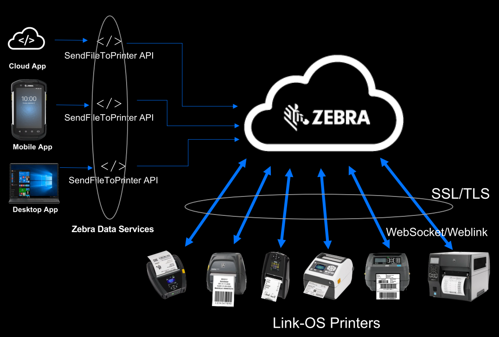
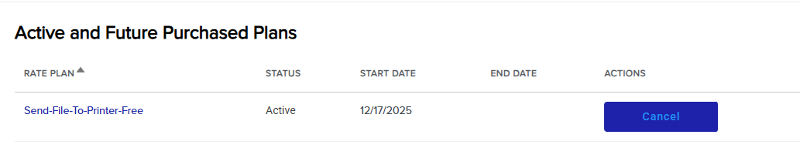
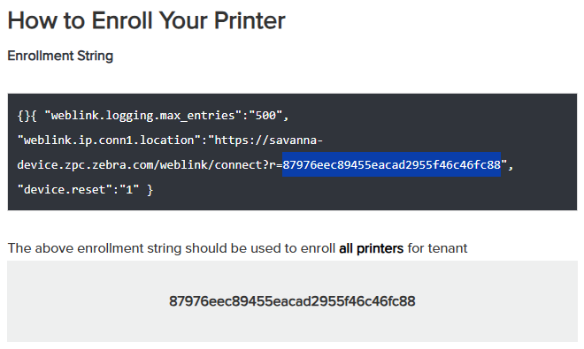
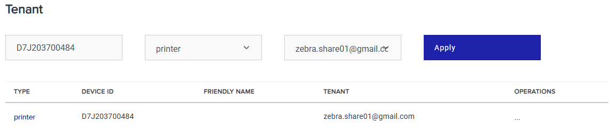

### Demo-02_Link-OS_Cloud-Print_SendFileToPrinter
# クラウド印刷（SendFileToPrinter APIの活用したデモ）


Cloudの普及により、インターネット経由でCloudから直接印刷をしたいという要望が2025年度以降よりリクエストが増加。この場合、Zebra社のプリンタからは２つのアプローチ方法がある。

</br>

1. Cloud Connect(旧Weblink)
2. SendFileToPrinter 

</br>

本頁では**SendFileToPrinter**(以降SFTP)のデモ環境構築の基礎について説明する。



</br></br>  
# Zebra SendFileToPrinterとは  

クラウド経由でインターネット接続されたプリンタに印刷指示がかけられます。下記のような特徴があります。

1. REST APIでプリンタに指示
1. セキュアな接続（暗号化・SSL/TLS）
1. サーバ（クラウド・オンプレ）から印刷指示
1. Zebra Savana Cloud経由のデータ送信

</br></br>  
# SendFileToPrinterが利用できるプリンタ

1. Link-OS 7.x 以上のプリンタ
1. ネットワーク I/Fが搭載されたプリンタ

</br></br>  
# SendFileToPrinterでできること

1. 印刷指示(ZPL)をプリンタに送信
1. 設定指示(SGD)をプリンタに送信
1. ファイルをプリンタに保存(画像、フォント、NW証明書など)

</br></br>  
# SendFileToPrinterでできないこと

1. プリンタのステータス確認
1. プリンタ内のデータを取得

※SFTPは単方向通信


</br></br>  
# 参考資料  
- [Devcon 2023: SendFileToPrinter – Cloud-based Label Printing API / PDF](https://www.zebra.com/content/dam/zebra_dam/en/presentation/customer-facing/zebra-devcon2023-presentation-customer-facing-cloud-printing-steven-si-en-us.pdf)  
- [Devcon 2023: SendFileToPrinter – Cloud-based Label Printing API / Youtube](https://www.youtube.com/watch?v=Oj-IH0Pr97A&t=1393s)
- [SenFileToPrinter](https://developer.zebra.com/apis/sendfiletoprinter-model#/SendFileToPrinter/SendFiletoPrinter)    
- [Data ServiceにAppsの追加方法：GETTING STARTED WITH ZEBRA DATA SERVICES](https://developer.zebra.com/docs/getting-started)    
- [Deviceをテナントに追加する方法：Enrolled Devices](https://developer.zebra.com/my-devices)  
- [Use the SendFileToPrinter API for Your Cloud-Based Printing Needs](https://developer.zebra.com/blog/use-sendfiletoprinter-api-your-cloud-based-printing-needs?tactic_type=WBP&tactic_detail=Desc_AV_GL_None_Youtube)
  
</br></br>  
# SFTP (Send File To Printer) デモ環境構築手順  
  
1. Zebra Developersのユーザを作成する  
https://developer.zebra.com/ > (右上)Register  
  
1. SendFileToPrinterのActivate  
  
    1. https://developer.zebra.com/apis/sendfiletoprinter-model  
    1. 画面右の「Activate」をクリックする。  
    1. 利用規約に同意し、「Purchase Plan」をクリックする。  
    1. SendFileToPrinterのActivateを確認する。  
  
      
  
1. 自社向けのSendFileToPrinter用のData Services Appを作成する。  
    - 左上のメニュー > My Data Services > Apps > Create App+  
[GETTING STARTED WITH ZEBRA DATA SERVICES：画面UIが少し古いので注意](https://developer.zebra.com/docs/getting-started)   
    - App Name：任意  
    - Description：任意  
    - APIs：「Send File To Printer」 にチェックを入れる。  
    - 「Add App」をクリックする。  
  
1. プリンタをData Servicesに登録する。  
    1. 左上のメニュー > My Data Services > Devices > Add Device+  
    1. プリンタの登録  
    - Device Type: Printers  
    - Tenant: 登録のメアドを選択。  
    --> Get Enrollment String をクリックして、登録用の文字列を取得・保存する。**（重要）**  
    1. ガイド文中のTENTANT IDをメモしておく。  
    下記例の場合、87976eec89455eacad2955f46c46fc88がTENTANT IDになる。  
      
  
    1. ガイドに従い、「Enrollment String」をプリンタに送信。  
    1. プリンタが再起動する。  
    1. テナントにプリンタが登録されることを確認する。  
      
      
  
1. Data Services AppのConsumer Keyを取得する。  
    1. 左上のメニュー > My Data Services > Apps  
    1. 先ほど作成したAppの行の右端の「View Details」をクリックする。  
    1. Consumer Keyをメモしておく。  
  
1. SendFileToPrinterの実行  
    1. Servers: Production Serverを選択。   
    1. 「Try it out」を選択し、必要な情報を入力する。  
        - apikey: Data Services AppのConsumer Key  
        - tenant: My Data Services > Devices のTENANT列のID  
        - sn: プリンタのシリアル番号  
        - zpl_file: 送信するZPLファイルを選択する。     
    - curlコマンドでSendFileToPrinter APIを実行する。  
    - 以下の情報を指定する。  
        - apikey: Data Services AppのConsumer Key  
        - tenant: 上記でメモしたTENANT列のID  
        - sn: プリンタのシリアル番号  
        - zpl_file: 送信するZPLファイルのパス  
  
  
</br></br>  
# PowerShellでの実行例  (curl.exe)
  
- 構文  
  
    ```powershell  
  
    curl.exe -X POST `  
    "https://api.zebra.com/v2/devices/printers/send" `  
    -H "accept: text/plain" `  
    -H "apikey: [My Data Services> Apps > 該当のApp > Consumer Key]" `  
    -H "tenant: [My Data Services> Devices > TENANT行のID]" `  
    -H "Content-Type: multipart/form-data" `  
    -F "sn=[プリンタのシリアル番号]" `  
    -F "zpl_file=@[フルパス+ファイル名];type=text/plain"  
    ```  
  
- 成功例 / Tenant ID: zebra  
  
    ```powershell  
  
    注）改行は`でつなげる  
    注）curl.exeを使うこと  
  
    curl.exe -X POST `  
    "https://api.zebra.com/v2/devices/printers/send" `  
    -H "accept: text/plain" `  
    -H "apikey: kSSO9AAtPzienatGAsUOwWmS31xysZG9" `  
    -H "tenant: zebra" `  
    -H "Content-Type: multipart/form-data" `  
    -F "sn=D7J203700484" `  
    -F "zpl_file=@C:\Users\moget\Downloads\temp\aaa.txt;type=text/plain"  
    ```  
  
- 成功例 / Tenant ID: 87976eec89455eacad2955f46c46fc88 (zebra.share01@gmail.com)  
    ```powershell  
    curl.exe -X "POST" `  
    "https://api.zebra.com/v2/devices/printers/send" `  
    -H "accept: text/plain" `  
    -H "apikey: Cwvhpf7N21eq8cy4alsV1rOLClvtVx2x" `  
    -H "tenant: 87976eec89455eacad2955f46c46fc88" `  
    -H "Content-Type: multipart/form-data" `  
    -F "sn=D7J203700352" `  
    -F "zpl_file=@C:\Users\moget\Downloads\temp\aaa.txt;type=text/plain"  
    ```  
  
- 実行例  
    ```powershell  
    PS C:\Users\moget> curl.exe -X POST `  
    >> "https://api.zebra.com/v2/devices/printers/send" `  
    >> -H "accept: text/plain" `  
    >> -H "apikey: kSSO9AAtPzienatGAsUOwWmS31xysZG9" `  
    >> -H "tenant: zebra" `  
    >> -H "Content-Type: multipart/form-data" `  
    >> -F "sn=D7J203700484" `  
    >> -F "zpl_file=@C:\Users\moget\Downloads\temp\aaa.txt;type=text/plain"  
    ```  
  
- 返り値  
  
    ```powershell  
    {"responses":[{"guid":"832916729", "sn":"D7J203700484", "status":"SUCCESS"}], "status":"SUCCESS"}  
    PS C:\Users\moget>  
    ```  
  
    [返り値の構文](https://developer.zebra.com/apis/sendfiletoprinter-model#/SendFileToPrinter/SendFiletoPrinter)  
  
  
    ----  
  
</br></br>  
# デモ用 SendFileToPrinter用のHTML(ローカルパソコンで実行可能)  


```html  
<!DOCTYPE html>  
<html lang="ja">  
<head>  
<meta charset="UTF-8">  
<title>Submit Example</title>  
</head>  
<body>  
<p>Zebra SendFileToPrinterを用いてデータを送信+レスポンスの表示をします。</p>  
<form id="zebraForm">  
    <button type="submit">送信</button>  
</form>  

<script>  
    <!-- - フォームの submit イベントをキャッチして処理を行います。-->  
    document.getElementById("zebraForm").addEventListener("submit", async function(e) {  
    e.preventDefault(); // ページ遷移を防止  

    const formData = new FormData();  
    formData.append("sn", "D7J203700352");  
    formData.append("zpl_file", new File(["^XA^FO50,50^A0N,50,50^FDHello Zebra!^FS^XZ"], "bbb.txt", { type: "text/plain" })); // ここではサンプルデータを直接指定しています  
        
    // fetch を使うことで curl と同じリクエストをブラウザから送信できます。  

    const response = await fetch("https://api.zebra.com/v2/devices/printers/send", {  
        method: "POST",  
        // curlのheader(-H)に相当する部分の指定  

        headers: {  
        "accept": "text/plain",  
        "apikey": "Cwvhpf7N21eq8cy4alsV1rOLClvtVx2x",  
        "tenant": "87976eec89455eacad2955f46c46fc88"  
        },  
            
        // curlのform(-F)に相当する部分の指定   
        body: formData  
    });  

    const text = await response.text();  
    alert("Response: " + text);  
    });  
</script>  
</body>  
</html>  
```  